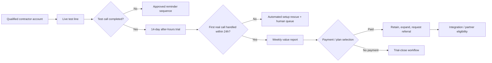

# SMIRK: Autonomous Revenue Engine

**Prepared for Cam**
**Date:** August 13, 2026
**Purpose:** Turn SMIRK from an automated outreach activity into a controlled system that acquires, activates, retains, and expands paying home-service accounts.

## Bottom Line

**Do not scale the existing cold-email process as the primary growth engine.** It has produced activity, not validated demand: the campaign history shows **414 sends and zero prospect replies** before the Aug. 6 run. More volume against the same offer is not autonomous revenue; it is an automated way to accumulate non-response.

The high-leverage move is to sell one narrow, measurable job-to-be-done:

> **SMIRK captures after-hours and overflow calls for 5–20-truck plumbing and HVAC contractors, qualifies the caller, routes or books the next step, and proves the value every week.**

That wedge matches the actual economic pain. Housecall Pro cites Invoca data indicating home-service businesses miss about **27% of inbound calls**, and it reports an average lost-revenue estimate of **$1,200 per missed call**. Those figures are vendor-published and should be treated as directional—not as a claim SMIRK makes to customers—but they validate the urgency of the problem. [1]

The strategic objective is not “make outreach autonomous.” It is:

1. **Autonomously create product proof** through an immediate live test and short trial.
2. **Autonomously convert proof into paid subscriptions** through low-friction self-serve checkout.
3. **Autonomously prove retained value** through a weekly call-capture and booking report.
4. **Keep humans at the points where bad automation can create legal, operational, or reputational damage.**

---

## What the Research Changes

| Finding | Implication for SMIRK |
|---|---|
| The category is already crowded. Rosie sells 24/7 AI answering at **$49 / $149 / $299 per month**, with scheduling, transfers, and texting available at higher plans; it also offers a 7-day trial. [2] | SMIRK cannot win as a generic “AI receptionist.” It needs a vertical, outcome-centered wedge: **after-hours/overflow call capture for emergency-prone trades**. |
| Smith.ai positions a free evaluation path and charges **$150/month** for its Pro AI receptionist tier, with per-call pricing and higher plans for deeper setup/customization. [3] | A realistic paid price anchor is roughly $99–$199/month. Do **not** promise unlimited usage until telephony, inference, and support cost per account are measured. |
| Housecall Pro explicitly sells 24/7 call handling and presents missed-call coverage as a core contractor need; its public API is available only to MAX-plan customers. [1] [4] | Integrations matter for retention, but a Housecall Pro API integration cannot be the Day-1 acquisition dependency. Many prospects will not have the needed plan. |
| ServiceTitan has a marketplace and reports more than 70% of customer tenants use a marketplace app. But it has moved to a formal certification process, and its own catalog now includes an AI Voice Agent. [5] [6] | Marketplace distribution is a **later** moat, not an early wedge. Build it only after product proof and customer evidence exist; ServiceTitan is both a channel and a competitor. |
| The FTC states CAN-SPAM applies to commercial B2B email as well as bulk email. It requires truthful routing and subjects, ad identification, a valid postal address, a clear opt-out, and honoring opt-outs within 10 business days. [7] | Automation must be compliance-first: centralized suppression, exact logging, approved templates, and no improvised follow-up behavior. |
| The FCC treats AI-generated voices in outbound robocalls as “artificial” under the TCPA. [8] | **No outbound AI cold calls.** SMIRK’s AI should operate on inbound calls for customers, using customer-approved playbooks and disclosure controls. |

---

## The Offer to Sell First

### Productized wedge: “After-Hours & Overflow Revenue Capture”

Do not lead with “AI phone agent.” That is a feature label and invites comparison to every generic voice vendor. Lead with a concrete operating outcome:

> **When your team cannot answer, SMIRK captures the caller, screens the issue, follows your approved emergency rules, texts the right person, and books or hands off the next step.**

The first version should cover **after-hours, lunch/peak-time overflow, and simultaneous calls**—not replace the contractor’s entire office.

| Included in the initial package | Explicitly excluded until proven safe |
|---|---|
| Answer with the contractor’s approved greeting | Diagnosing a technical problem |
| Capture name, phone, location, trade, urgency, and service window | Giving technical or safety advice beyond an approved script |
| Ask a small approved set of qualifying questions | Quoting prices, discounts, or arrival times without an approved rule |
| Escalate defined emergency categories to an approved on-call path | Making subjective dispatch decisions outside the decision tree |
| Offer a booked slot only if the calendar/integration confirms availability | Inventing availability, policies, licensing claims, or promotions |
| Send the contractor a structured summary and transcript | Continuing to pursue a caller after an explicit stop/opt-out request |

### Packaging to test—not permanently declare

The evidence supports a **$99–$199 monthly testing band**, not a fixed universal price. Rosie’s public $149 Scale plan includes 1,000 minutes, scheduling, call transfers, and in-call texts, so SMIRK cannot simply charge more for less generic functionality. [2]

A disciplined test is:

| Offer | Initial use case | Test price | Guardrail |
|---|---|---:|---|
| **Overflow Starter** | After-hours message capture + emergency text routing | $99/month | Cap minutes and automations; no calendar booking until activated successfully |
| **Booked Jobs** | Approved scheduling/transfer + weekly value report | $149/month | Start with a measured allowance, not “unlimited” |
| **Multi-line / Multi-location** | Waterfall transfer, multiple service areas, custom workflows | Quote after 30 days of real usage | Require a review of margin, workflow complexity, and support burden |

The first five paying accounts are not a pricing conclusion. They are a **pricing and cost-discovery experiment**.

---

## The Autonomous Revenue Loop

The system must be built as a state machine with hard gates, not as a free-running LLM that decides what to do next.

### Acquisition: make the first proof instant

Cold email is merely a routing mechanism to the test, not the product experience. Every qualified prospect should reach one clear CTA:

> **“Call this number and hear how SMIRK would answer your after-hours calls.”**

The demo must be a real, vertically configured call—not a Calendly request, explainer video, or generic chatbot. A plumber should hear plumbing triage; an HVAC owner should hear HVAC triage. The objective is to make the prospect experience the service in less than 60 seconds.

The current email sequence has not proved that the CTA or the offer works. Before expanding list volume, run a controlled test between two propositions:

| Variant | Claim to test | CTA |
|---|---|---|
| **Revenue leakage** | “Your team is losing jobs when calls go to voicemail.” | Call the live line |
| **After-hours relief** | “Cover nights, weekends, and overflow without adding an office hire.” | Start a 14-day after-hours trial |

Use a real cohort and define success **before** sending. No result means change the offer or audience—not write more copy.

### Activation: solve the only metric that matters early

**Time to first value** is the pivotal metric: elapsed time from sign-up to the first correctly handled live call. The target should be **under 24 hours**.

A trial should automate only deterministic setup:

1. Capture business name, service areas, hours, emergency rules, on-call numbers, and calendar choice.
2. Generate a structured approval sheet for the contractor to confirm.
3. Provide carrier-specific call-forwarding instructions.
4. Test the path with a real test call.
5. Enable after-hours/overflow routing only after the test passes.
6. Create checkout access only after the product is live.

The AI can help explain setup. It must **not** silently invent policy, map emergency severity, or enable an unreviewed workflow.

### Monetization: payment follows visible proof

Use recurring card billing only after the contractor sees a working call flow. The trial-close message should show verifiable activity—not invented “recovered revenue”:

| Reported metric | Safe? | Why |
|---|---|---|
| Calls answered by SMIRK | Yes | Directly observable |
| Qualified leads / booking requests captured | Yes | Directly observable when the criteria are defined |
| Confirmed booked appointments | Yes, if calendar confirmation exists | Directly observable |
| Estimated revenue recovered | Only with transparent assumptions and an explicit disclaimer | Revenue attribution is not directly known |
| “We made you $X” | No | Overstates causality without closed-job data |

### Retention: make the product financially obvious every week

Each active customer should receive a weekly digest built from actual event data:

- Calls answered, split by after-hours, overflow, and emergency path.
- Lead details captured and action outcome.
- Confirmed appointments or transfers.
- Calls that escalated or failed, with the reason.
- Optional conservative value estimate only if the account supplied its average realized job value and the estimate is labelled.

This report is the retention engine, the expansion trigger, and the source for future case studies. It must never fake ROI.

---

## The Control Plane: What Is Autonomous vs. Human-Approved

| Capability | Autonomous action | Hard gate / escalation |
|---|---|---|
| Prospect research | Identify trade, geography, size signals, website, public phone/email, and CRM fit score | No scraping that violates source terms; no outreach to suppressed or unverified records |
| Email outreach | Send only approved templates through the authorized sender; write exact Resend result to ledger | No new template, increased volume, or manual resend without an approved policy |
| Lead response | Deliver live test access, schedule a product conversation, and create trial records | Never make commercial promises outside approved terms |
| Trial setup | Gather structured configuration, generate test steps, send reminders, test forwarding | Customer must approve service rules and pass a test before go-live |
| Inbound call handling | Follow approved decision trees, collect facts, transfer/notify/book where confirmed | Immediate human escalation for uncertainty, safety issues, negative sentiment, payment data, or undefined scenarios |
| Billing | Stripe subscription lifecycle, receipts, controlled failed-payment sequence | Human review for refunds, unusual usage, disputes, or plan exceptions |
| Retention | Send factual weekly digest and trigger check-in on failed activation or declining usage | Do not claim revenue, solicit reviews, or send SMS without the correct consent and policy basis |
| Growth | Queue partner/referral candidates from happy accounts | Human approval for partnership terms, discounts, public case studies, and new integrations |

The core rule is simple: **the model may classify and draft; deterministic code decides whether it is allowed to act.**

---

## Architecture That Is Worth Building

Build the smallest system that can run the above loop, with an audit log around every consequential event.

| Layer | Minimum capability | Decision rule |
|---|---|---|
| System of record | CRM/account table covering prospect, trial, customer, configuration, consent, and lifecycle state | Every action must be traceable to one account and one state transition |
| Event bus / workflow engine | Webhooks for trial signup, test call, first live call, appointment, payment, failed payment, unsubscribe | Idempotent events; retries must not duplicate messages, charges, or bookings |
| Voice runtime | Structured prompt + tool-limited call flow + recording/transcript policy | No free-form tool access; no pricing or emergency behavior outside account configuration |
| Billing | Stripe customer, subscription, invoices, payment-failure events | Plan changes only from defined rules or human approval |
| Analytics | Funnel events: qualified → test → trial → first value → paid → retained | Measure actual conversion and cost at each stage |
| Compliance | Centralized suppression, consent records, disclosure version, call/recording jurisdiction rule | A compliant stop beats a revenue action every time |
| Human exception queue | One workspace for emergency ambiguity, failed setup, objection, refund, negative sentiment, and compliance events | Defined SLA and ownership; automation stops at the boundary |

Do **not** build a broad autonomous agent platform first. Build the product proof loop first. A full orchestration layer is justified only after SMIRK has enough active accounts and exception data to know which workflows are worth automating.

---

## Execution Paths

Two viable paths exist. They differ in speed, capital risk, and the amount of unproven infrastructure they create.

| Approach | Tradeoffs | Cost profile | Setup complexity |
|---|---|---|---|
| **Revenue-proof loop first**: live test line, after-hours trial, Stripe checkout, configuration wizard, weekly digest, manual exception handling | Fastest way to learn whether contractors pay. It does not yet create a marketplace-scale platform. | Low initial infrastructure cost; customer support remains partly manual. | Moderate; can be operational in 1–2 weeks if the core voice product works. |
| **Full autonomous platform first**: CRM, self-serve onboarding, multiple FSM integrations, automated scoring, partner portal, lifecycle engine | More scalable if the offer is already proven. High risk of building around an offer buyers do not convert on. | Higher engineering, integration, and compliance cost before revenue. | High; realistically a multi-week build with ongoing maintenance. |

**Decision criteria:** choose the first path until SMIRK has **five paying accounts that reached first value** and can supply real call/booking evidence. Only then build the heavier self-serve and partner layers. This is not a concession; it is the fastest route to a system that does not automate a bad assumption.

---

## 30-Day Roadmap

| Window | Objective | Deliverable | Exit criterion |
|---|---|---|---|
| **Days 1–3** | Stop measuring activity as success | One landing page, one plumbing/HVAC live test line, two controlled propositions, CRM states, precise event schema | A prospect can test the live voice flow in under one minute |
| **Days 4–7** | Prove activation | 14-day after-hours/overflow trial, onboarding form, approval sheet, forwarding test, basic payment page | First trial passes an actual call-routing test |
| **Week 2** | Prove conversion | Automated trial nudges, Stripe subscription, weekly value report, human exception queue | At least one prospect reaches a tested trial or paid decision based on product experience |
| **Week 3** | Prove retention signal | Value digest, call outcome taxonomy, churn-risk triggers, explicit configuration review | Every active trial/customer can see factual outcome data |
| **Week 4** | Prove repeatability | 5-account pilot cohort, pricing/cost review, referral request only after verified value | Five paid or rigorously documented non-conversion outcomes identify the actual bottleneck |

### Gates before heavier investment

| Do not build this yet | Until this is true |
|---|---|
| ServiceTitan marketplace application and certification work | Five paying accounts demonstrate a repeatable workflow and customer outcomes |
| Housecall Pro API integration | A meaningful share of target customers uses MAX, or the integration directly closes/retains real accounts |
| Paid acquisition | A measurable test-to-trial and trial-to-paid path exists |
| Multi-trade expansion | Plumbing/HVAC offer is converting and onboarding reliably |
| Uncapped “unlimited” pricing | Cost per call/minute and support load are measured across real accounts |

---

## Measurable Operating Scorecard

### Early-funnel proof

The current funnel needs a reset. With a 50-email/day operating ceiling, 20 weekday sends yields only **1,000 emails/month**. At a hypothetical 1% test-call rate, that is about **10 live tests/month**; at a 25% paid conversion from an activated trial, that produces roughly **2–3 customers/month**. Those are scenario calculations—not forecasts—but they show why offer quality and conversion matter more than increasing sequence volume.

| Metric | Definition | Initial target / decision use |
|---|---|---|
| Qualified email → live test | Unique prospects that complete the test call ÷ delivered eligible emails | Establish baseline within first 100 delivered emails; if zero, change offer/audience before scaling |
| Live test → started trial | Trials created ÷ live test calls | Diagnose whether test experience creates enough intent |
| Trial activation in 24h | Trials with an approved live route within 24h ÷ trials | Target **≥60%**; below that means setup is the product bottleneck |
| First value | Hours from signup to first correctly handled real call | Target **<24 hours** |
| Activated trial → paid | Paid subscriptions ÷ activated trials | Target **≥25%** as an internal starting threshold, then revise from real data |
| Gross margin per active account | Subscription revenue less telephony, AI, SMS, integration, and attributable support costs | Never price or scale without this measurement |

### Product and retention proof

| Metric | Definition | Why it matters |
|---|---|---|
| Approved-call resolution rate | Calls completed in the approved workflow ÷ calls answered | Measures product reliability, not vanity volume |
| Escalation / failure rate | Calls requiring human intervention or failing policy ÷ calls answered | Primary safety and support-load signal |
| Confirmed booking/transfer rate | Confirmed next actions ÷ qualified callers | Direct measure of customer value |
| Weekly digest engagement | Accounts viewing/acknowledging factual report ÷ active accounts | Early churn signal |
| Account expansion eligibility | Accounts repeatedly near usage or adding service areas | Identifies justified upgrade opportunities |

### Compliance non-negotiables

| Metric | Required result |
|---|---|
| Suppression violations | **0** |
| Unlogged outbound sends | **0** |
| Expired/invalid opt-out handling | **0** |
| Inbound call flows operating without customer-approved disclosure/policy | **0** |
| Automated AI cold calls | **0** |

---

## Non-Negotiable Risk Controls

The commercial opportunity is real. The dangerous version of this plan is trying to obtain it by turning the AI loose on sales, voice, payment, and emergency-dispatch decisions.

> **SMIRK should automate collection, routing, state transitions, reminders, reporting, and documented workflows. It should not autonomously make unsupported claims, prospect by AI robocall, set a price outside policy, improvise an emergency response, or override an opt-out.**

Inbound voice also needs a formal compliance review before broad launch. Call-recording consent varies by jurisdiction; AI disclosure and recording language should be versioned per account and reviewed by qualified counsel before handling live customer data. The source material here identifies the risk; it is not legal advice. [7] [8]

---

## The Immediate Strategic Move

The shortest path to autonomous revenue is not a larger agent swarm.

It is a single narrow loop:

1. **Target plumbing/HVAC operators with an after-hours call-loss problem.**
2. **Make the product tangible via a live test line.**
3. **Let them start a limited after-hours/overflow trial.**
4. **Get the first real call handled in under 24 hours.**
5. **Show the factual outcome weekly.**
6. **Collect recurring payment after observable value.**
7. **Automate only the repeated, logged, policy-bounded parts.**

Everything else—including multi-trade expansion, app marketplaces, complex integrations, aggressive outbound volume, and broader agent autonomy—is downstream of that proof.

---

## References

[1]: https://www.housecallpro.com/resources/missed-calls/ "Housecall Pro — The Hidden Costs of Missed Calls for Home Service Business Owners"

[2]: https://heyrosie.com/pricing "Rosie — AI Answering Service Pricing"

[3]: https://smith.ai/pricing/ai-receptionist "Smith.ai — AI Receptionist Pricing"

[4]: https://help.housecallpro.com/en/articles/8505035-api-overview "Housecall Pro — API Overview"

[5]: https://marketplace.servicetitan.com/ "ServiceTitan Marketplace"

[6]: https://www.servicetitan.com/blog/app-marketplace-relaunch "ServiceTitan — App Marketplace: Raising the Bar with App Certification"

[7]: https://www.ftc.gov/business-guidance/resources/can-spam-act-compliance-guide-business "FTC — CAN-SPAM Act: A Compliance Guide for Business"

[8]: https://www.fcc.gov/document/fcc-makes-ai-generated-voices-robocalls-illegal "FCC — AI-Generated Voices in Robocalls"

---

**Author:** Manus AI
**Research method:** Eight parallel research tracks, with high-stakes factual claims independently verified against primary or first-party sources where available.

**Evidence-quality note:** Several market and ROI figures circulating in this category are vendor- or platform-published. They are useful directional signals, but SMIRK should use customer-specific, observable call and booking data—not industry averages—as the basis for commercial claims.
